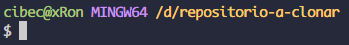

# GIT [Revisar documentacion](https://git-scm.com/book/es/v2) 

- [GIT Revisar documentacion](#git-revisar-documentacion)
  - [Comandos Basicos Linux](#comandos-basicos-linux)
    - [Indentificadores de colores](#indentificadores-de-colores)
  - [Repositorio](#repositorio)
    - [Configuracion:](#configuracion)
    - [Comandos basicos repositorio :](#comandos-basicos-repositorio-)
    - [GitHub](#github)
    - [Clonar un repositorio:](#clonar-un-repositorio)
      - [DEPENDENCIAS](#dependencias)
    - [Revisar el Estado de tus Archivos](#revisar-el-estado-de-tus-archivos)
    - [Historial se Confirmaciones](#historial-se-confirmaciones)
      - [Git log](#git-log)
      - [Git log en ramas](#git-log-en-ramas)
  - [Otros cambios en el repositorio](#otros-cambios-en-el-repositorio)
    - [Alias](#alias)
    - [Deshacer un Archivo Preparado](#deshacer-un-archivo-preparado)
    - [Ignore](#ignore)
    - [Reset](#reset)
    - [Mover](#mover)
    - [Eliminacion de **archivos**](#eliminacion-de-archivos)
    - [TAG](#tag)
      - [TAG Ligero:](#tag-ligero)
      - [TAG anotada](#tag-anotada)
      - [TAG tardio](#tag-tardio)
    - [END](#end)
    - [BRANCH o ramas](#branch-o-ramas)
    - [Switch](#switch)
    - [Merge](#merge)
    - [Conflictos a raiz de un **MERGE**](#conflictos-a-raiz-de-un-merge)
    - [Stash](#stash)
  - [Flujo colaborativo de GITHUB](#flujo-colaborativo-de-github)
    - [fork](#fork)
    - [pull request (pr)](#pull-request-pr)

## Comandos Basicos Linux
| Comando | Utilidad | 
| -- | -- | 
| ls | Ver el contenido del directorio en el que se encuentra el prompt. | 
| cd directorio | Acceder al directorio. | 
| cd .. | Un paso atras del promp. | 
| pwd | Revisar donde estamos ubicados. | 
| mkdir nomrbecarpeta | Crear carpeta.|
| touch nombrefichero.py, js, html, css, etc  | Crear archivos vacíos y cambiar marcas de tiempo de archivos o carpetas|
| mv archivo.txt /ruta/de/destino | Mover archivos a directorios o carpetas |
| cat | Imprime por pantalla el fichero seleccionado |
>Tambien se puede utilizar `ls` con el nombre de un directorio para ver el contenido.

***
### Indentificadores de colores
**Indentificador de colores, segun tipo de archivo/elemento:**
| Color | Referencia | 
| -- | -- | 
| Color azul | Carpetas | 
| Color verde | Archivos ejecutables | 
| Color azul celeste | Carpetas especiales de Windows | 
| Color blanco | Archivos (pdf, jpg, doc, md, js, etc.) | 

[Subir al inicio](#top)

***
## Repositorio
***
### Configuracion:

~~~
git config --global user.name "name"
git config --global user.email name@example.com
~~~
Combiar nombre de la rama (master a main):
~~~
git branch -m nombredelarama
~~~

[Subir al inicio](#top)
***
### Comandos basicos repositorio : 
>Normalmente mas usados:

Iniciar un repositorio local:
~~~
git init 
~~~
Agrega el repositorio a ***"STAYING AREA"***. "Por Confirmar" para luego transformarlo en un **COMMIT** (versión):
~~~
git add <archivo> 
~~~
O (si queremos agregar todos los cambios de todos los archivos del **Directorio** actual a ***"STAYING AREA"***):
~~~
git add . 
~~~
Agregar la versión al repositorio. (**-m = mensaje**):
~~~
git commit -m "mensajedeconfirmación" <archivo>
o 
git commit -a -m "amensajedeconfirmación"
~~~
Al agregar `-a` no es necesario hacer un `add .` antes. Se salta el area de preparacion.

[Subir al inicio](#top)
***
### GitHub
Para subir los archivos al servidor Remoto debemos pasar por los estados de  **ADD** y luego el **COMMIT**.

Para subir los cambios a **GITHUB** :
~~~
git push origin main
~~~
Nos pedira Clave o Key.
***
### Clonar un repositorio:
1. Copiar la URL del respositorio remoto que deseas clonar ***GITHUB*** :
~~~
git clone <copiamos y pegamos el ssh del repositorio que queremos clonar>
~~~
2. Abrir la terminal.
3. Crear un directorio para el proyecto que clonaremos.
4. Situarnos sobre el directorio `(cd, cd ..)`. Ejemplo: 
  
   
6. Lanzamos el comando para hacer el clon `git clone https://github.com/ .`
    > El último punto indica que el clon se colocara en la carpeta donde esta situado el terminal.
 #### DEPENDENCIAS
Los repositorios clonados, habitualmente tienen ignoradas las dependencias con el archivo `.gitignore`. Estas debemos instalarlas de nuevo en el repositorio clon, en el directorio creado (local).

Para cada lenguaje, existirán comandos para instalar las dependencias (gestor de dependencias) o gestores de dependencias del proyecto.

Por ejemplo: si es de `PHP` dependerá de `Composer`, si es de `NodeJS` (o `Javascript`) dependerá de `npm`.

[VER TAMBIEN](https://desarrolloweb.com/articulos/git-clone-clonar-repositorio.html#:~:text=C%C3%B3mo%20enviar%20cambios%20a%20GitHub%20si%20el%20repositorio%20no%20es%20tuyo%20(v%C3%ADa%20fork)) 

[Subir al inicio](#top)
***
### Revisar el Estado de tus Archivos
Revision **ESTADO** general del repositorio:
~~~
git status 
o
git status -s  
~~~
`-s` solamente muesta los ficheros en los cuales hubieron cambios y el estado en el que se encuentran.
>El comando te indica en cuál rama estás y te informa que ha variado con respecto a la misma rama en el servidor.
Tambien podemos usar 
~~~
git diff 
~~~
Este comando muestra las líneas exactas que fueron añadidas y eliminadas.

1. Revisaremos si se hicieron los cambios con `git status`.
***
### Historial se Confirmaciones
#### Git log
1. Luego revisaremos la version de commit con su identificador unico o **HASH** con su respectiva informacion:
~~~
git log 
o
git log --oneline
~~~
>El mecanismo que usa Git para generar esta suma de comprobación se conoce como hash SHA-1. Se trata de una cadena de 40 caracteres hexadecimales (0-9 y a-f), y se calcula con base en los contenidos del archivo o estructura del directorio en Git. Por ejemplo:
~~~
24b9da6552252987aa493b52f8696cd6d3b00373
~~~
>Git guarda todo no por nombre de archivo, sino por el valor hash de sus contenidos.

Tambien se puede hacer variantes de `git log` como :

| Comando log | Funcion | 
| -- | -- | 
| -p | Muestra las diferencias introducidas en cada confirmación. | 
| -2 | Se muestren únicamente las dos últimas entradas del historial. | 
| -p -2 | Diferencias y ultimas entradas del hitorial. | 
| --stat: | Estadísticas de cada confirmación. | 

[Subir al inicio](#top)

#### Git log en ramas
git puede mostrar las versiones de rammas por separado. Distinto a git log que muestra todo el historial del proyecto.

[Ver mas sobre git en ramas](https://es.stackoverflow.com/questions/496506/como-mostrar-el-log-de-una-rama-espec%C3%ADfica-de-git-sin-mostrar-la-rama-master) 

Mostrar commits que hay en una rama pero en las otras no:
~~~
git log --oneline --graph master..ramaquequeremosverloscommits
~~~
***
## Otros cambios en el repositorio
***
### Alias
Para no escribir el comando completo. Se puede guardar un comando corto en un alias para luego escribirlo:
>Esto se guardara en `.gitconfig`. Esto se encuentra la mayoria de veces en `user`, en nuestro dispositivo. 
~~~
git config --global alias.tree "log --graph --decorate --all --oneline"
~~~
Ahora se puede usar `git tree` y ejecutara el comando completo.
***
### Deshacer un Archivo Preparado
***Git checkout tiene muchas funciones pero tienen actualizaciones con nuevos comandos como `switch` o `restore` como para no confundirse.***

Si queremos deshacer los cambios que hemos hecho, luego de hacer un `add` volveremos al commit original:
~~~
git checkout nombredelficheroquedesharemoscambios
o
git restore nombredelficheroquedesharemoscambios
~~~ 
`git restore` **Fue creado para esta tarea en especifica** ***(BUENA PRACTICA)***
***
Y si queremos movernos de fichero cualquiera de antes del ultimo commit:
~~~
git checkout numerodefichero
~~~
Podemos usarlo para seguir desde ahi o ver los cambios que hice antes

[Subir al inicio](#top)
***
### Ignore
Creamos un fichero:
~~~
touch .gitignore
~~~
Pondremos los ficheros o rutas que no queramos que se añadan automaticamente o que ni siquiera aparezca como no rastreado.
>Crear un archivo `.gitignore` antes de comenzar a trabajar es generalmente una buena idea, pues así evitas confirmar accidentalmente archivos que en realidad no quieres incluir en tu repositorio Git.

[GitHub mantiene un repositorio con una extensa lista de archivos gitignore](https://github.com/github/gitignore) 
***

### Reset
Si queremos eliminar lo que teniamos y empezar desde un commit anterior. Vemos el id del commit al que queremos empezar y escribimos:
~~~
git reglog
git reset --hard commitalquequeremosir
~~~
Si queremos volver al ultimo commit. Escribimos lo mismo pero con el commit mas nuevo o al que queramos ir.

[Subir al inicio](#top)
***
### Mover
Para mover un archivo a un nuevo directorio:
1. mv archivo.1 archivo.2  /ruta/de/destino
2. Agregar los comandos:
    - git add .
    - git status 
    - git commit -m "Move file to new directory"
    - git push origin main
***
### Eliminacion de **archivos**
~~~
rm <archivo>
~~~
Si estamos en un archivo de un repositorio deberemos agregar los cambios a la ***"STAYING AREA"***

~~~
git add <archivo eliminado>
~~~
Luego el commit:
~~~
git commit -m "Eliminacion de archivo"
~~~
***Si antes del commit no queremos eliminar el archivo, aun cuando el archivo este en Staying Area:***
~~~
git restore --staged nombrefichero
git restore nombrefichero
~~~

[Subir al inicio](#top)
***
### TAG
Esta funcionalidad se usa típicamente para marcar versiones
de lanzamiento (v1.0, por ejemplo).

#### TAG Ligero:
Una etiqueta
ligera no es más que el checksum de un commit guardado en un archivo - no incluye
más información:
~~~
git tag <nombre del tag>
~~~
Listar las etiquetas disponibles `git tag`
#### TAG anotada
La forma más fácil de hacerlo es especificar la opción `-a` cuando ejecutas el comando `git tag`
~~~
git tag -a <nombreversion> -m '<mensaje de la etiqueta>'
~~~
Para ver la información de la etiqueta junto con el commit que está etiquetado al usar el comando `git show`

#### TAG tardio 
También se puede etiquetar commits mucho tiempo después de haberlos hecho.
Para etiquetar un **commit**, debes especificar el **checksum** del commit (o parte de él) ***al final del comando***: 
~~~ 
git tag -a v1.2 -m '<mensaje de la etiqueta>' <id de commit>
~~~

Para transferir el tag o tags a un servidor remoto como **GITHUB**:
~~~
git push origin [etiqueta] 
o
git push origin --tags
~~~
Por lo tanto, cuando alguien clone o traiga información de tu repositorio, también obtendrá todas las etiquetas.

[Subir al inicio](#top)
***
### END
Git log muestra el historial de todos los commits que hay, si hay muchos commits saldrá un signo de dos puntos `:` y la línea de donde se encuentra el cursor parpadeando, si presionamos `espacio` mostrará mas commits hasta llegar al último, y cuando termine, dira: `(END)`, para **SALIR**, presionamos `q`

***
### BRANCH o ramas
Las ramas son utilizadas para desarrollar funcionalidades aisladas unas de otras. La rama master es la rama "por defecto" cuando creamos un repositorio. 
* Crea nueva rama durante el desarrollo y cuento este terminada, funcionarlas.
>Por ejemplo queremos hacer un Login para una nueva pagina web.
>Entonces para no usar la rama principal. Hacemos una nueva rama

Opciones de `git branch`:

| Comando | Funcionalidad | 
| -- | -- | 
| git branch nombredelanuevarama | Crear nueva rama | 
| git branch | Lista de ramas | 
| git branc -v | Ultima confirmación de cambios en cada rama | 
| git branch --merged | Ramas que han sido fusionadas con la rama activa | 
| git branch --no-merged | ramas que contienen trabajos sin fusionar |
| git branch -d nombredelarama | Forzar eliminacion de la rama |

Una rama nueva no estará disponible para los demás hasta que se suban los cambios (push) de la rama al repositorio:
~~~
git push origin <branch>
~~~
### Switch
Nos moveremos por las ramas del repositorio con:
~~~
git switch nombredelarama
~~~

**LOS CAMBIOS QUE HAGAMOS EN ALGUNA RAMA NO SE AGREGARAN A LA RAMA MAIN O MASTER HASTA QUE HAGAMOS UN MERGE**
***
### Merge
Combinar los cambios entre ramas:
>Mantener soporte y  actualizados con otras ramas.

Ejemplo: Estamos en la rama login y queremos los cambios que hay en main entonces escribimos:
~~~
git merge main
~~~
***
### Conflictos a raiz de un **MERGE**
>Git no crea automáticamente una nueva fusión confirmada (merge commit), sino que 
>hace una pausa en el proceso, esperando a que tú resuelvas el conflicto.
Pasos:
1. `git status` para ver el conflicto (unmerged)
>Git añade a los archivos conflictivos unos marcadores especiales de resolución de conflictos.
2. Para resolver el conflicto, hay que de elegir manualmente el contenido de uno o de otro lado. Arreglarlo y despues. ***(segun los marcadores de git)***
3. `git add `para marcar cada archivo modificado.
4. git commit -m "correccion de conflictos merge rama con rama" .

[Subir al inicio](#top)
 ***
### Stash
Cuando queremos guardar para ir a otro lugar o rama, pero no hacer un commit:
> Lo guarda en un saco de cambios sin terminar que puedes volver a usar en cualquier momento.
~~~
git stash
git stash list
~~~
`git stash apply` para volver al que acabamos de guardar.

Si queremos volver a uno anterior, especificar el stash@:
~~~
git stash apply stash@{2}
~~~
`git stash pop` para hacer entrada al guardado y luego eliminarlo.

Para remover un stash ejecutar `git stash drop nombrestash`

***
## Flujo colaborativo de GITHUB
***
### fork
* No podremos hacer cambios a un repositorio de otra persona sin tener permisos.
* Si queremos hacer cambios entonces crearemos un `fork` desde el GUI de GitHub en el repositorio de donde esta el proyecto que queremos clonar en nuestro repositorio.
* Luego de hacer el `fork` clonaremos el repositorio con la clave `SSH` desde nuestro repositorio/perfil.
~~~
git clone https://github.com/usuario/repositorio
~~~
* Hacemos los cambios que queremos hacer, nuevos ficheros, directorios, cambios en el codigo, etc. 
* Subimos los cambios al servidor remoto `GitHub`.
* Los cambios se veran en nuestro repositorio pero en el **Repositorio Origen** no.
* Entonces solicitaremos al dueño del repositorio que vea nuestros cambios para hacer una especia de `MERGE` pero en repositorios distintos. (ejem: Por que son buenos cambios para el proyecto).
* **Siempre se debe mantener syncronizado con el original** `sync fork` en GUI GitHub.

### pull request (pr)
* `contribute` para constribuir con los nuevos cambios para el proyecto.
* `Create pull request` añadir un commit con un mensaje y descripcion para el receptor.
* Se envia.

**Receptor:**
* Se vera en una seccion `pull request` en mi repositorio que alguien quiere añadir o hacer cambios/retocar.
* Veremos el nombre del solicitante con el mensaje de commit.
* Abrimos y se vera la conversacion. Para ver los cambios los veremos al final como `Files changed`
* Esto se puede:
1. Comentar
2. Aprovar
3. Rechazar pero pedir cambios
* Una vez esta todo **aprovado y revisado**. Hacer un `Merge pull request` desde GitHub. Para agregar los cambios al repositorio principal.
* ***En el repositorio principal se veran los colaboradores del proyecto***

[Subir al inicio](#top)

***
